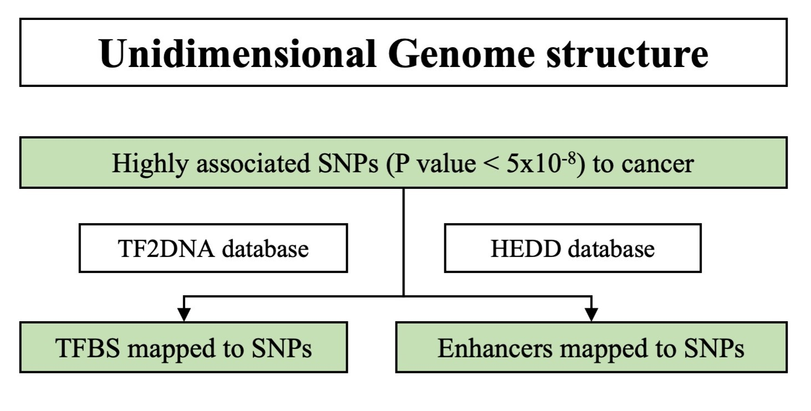
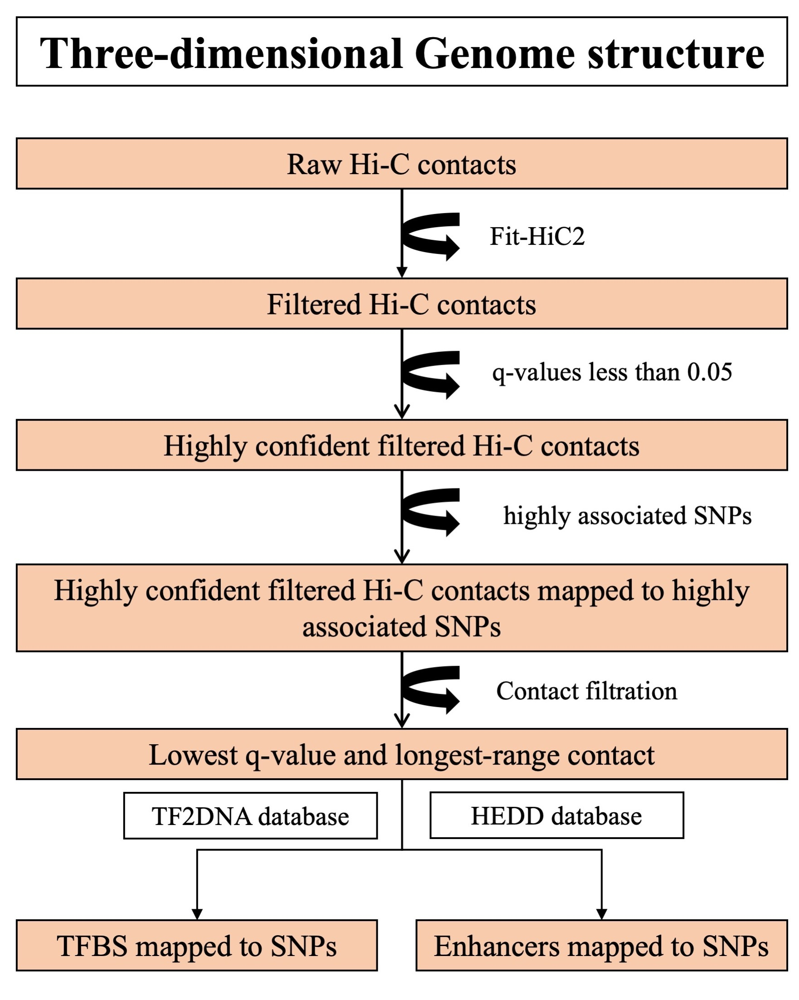
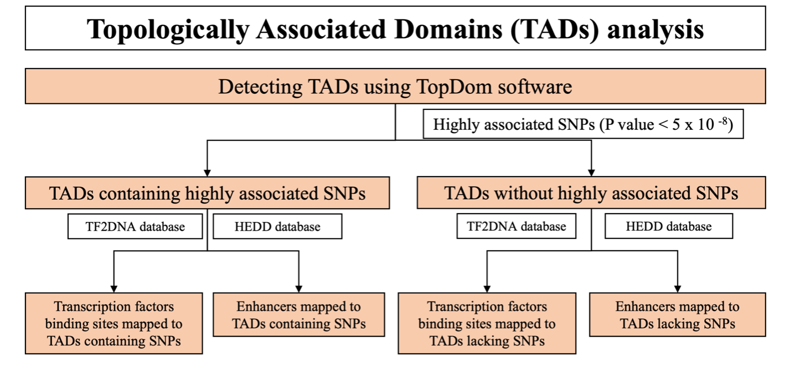

## Script used for creation of figures in our article to compare SNPs in linear structure against SNPs in three-dimenion structure:

## If you find this script is useful, please cite our article:

Osman, N., Shawky, AEM. & Brylinski, M. Exploring the effects of genetic variation on gene regulation in cancer in the context of 3D genome structure. BMC Genom Data 23, 13 (2022). https://doi.org/10.1186/s12863-021-01021-x

## This readme file and the script was created by Abd-El-Monsif Shawky.

Usage:

python figure_creation.py 

## FlowChart of the manuscript:

## Unidimensional structure analysis:

## Three-dimensional structure analysis:

## Topologically Associating Domains (TADs) analysis:

